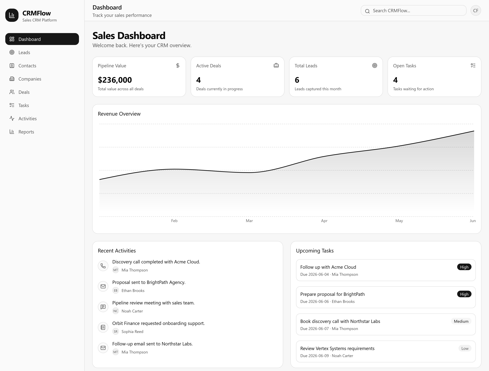
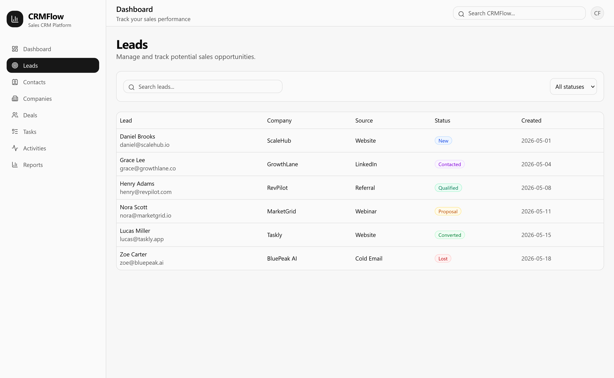
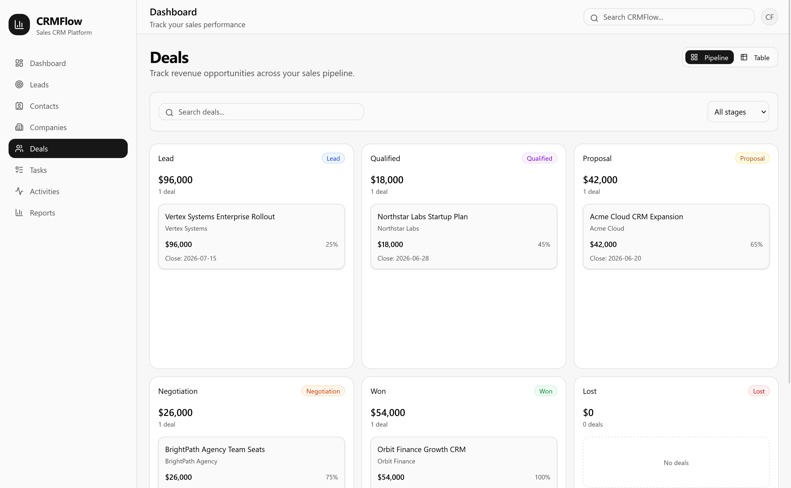
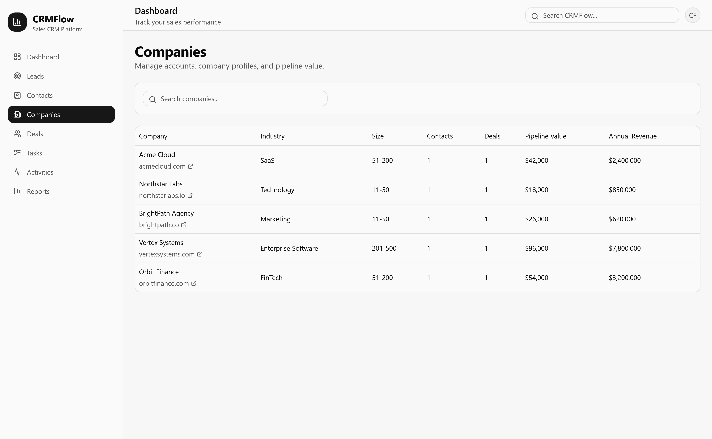
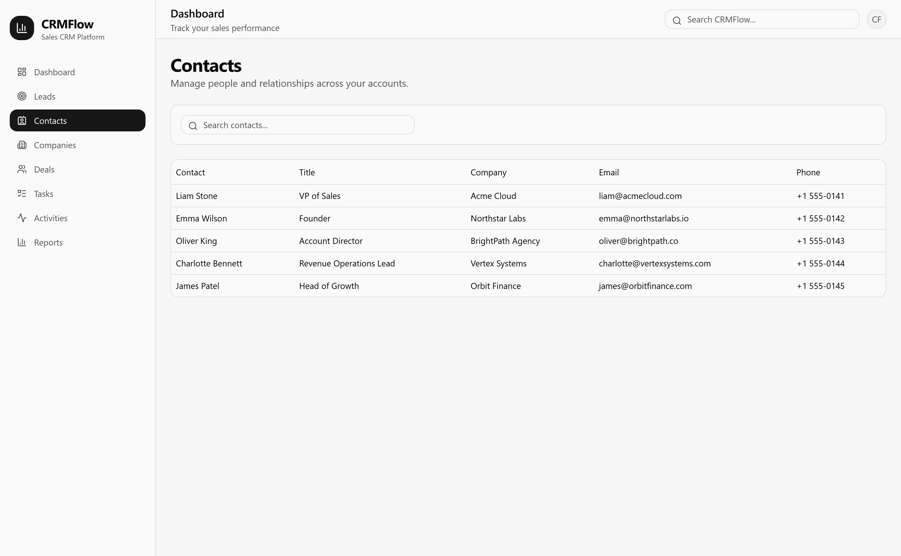
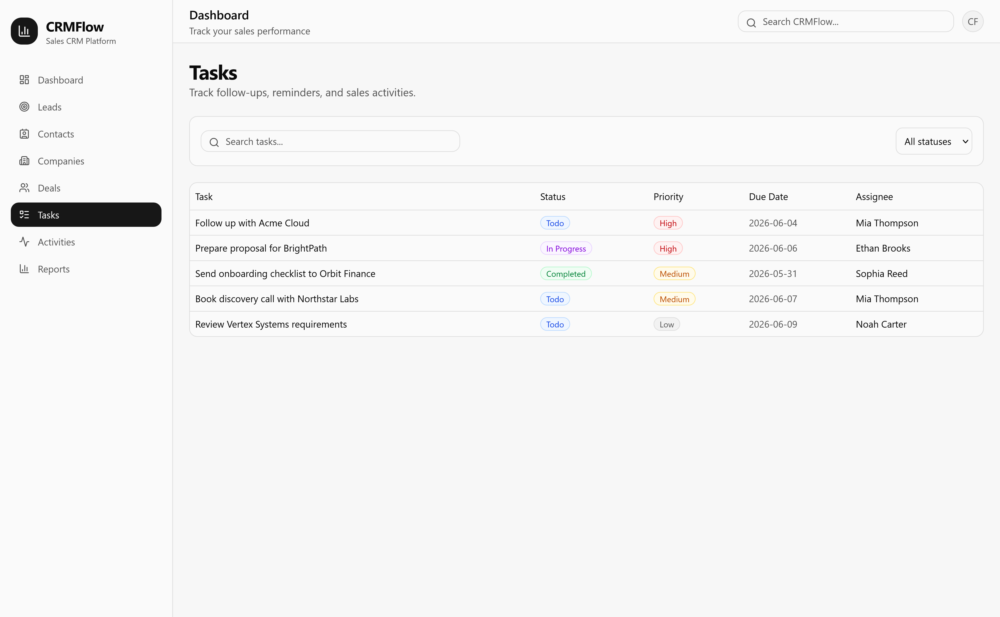
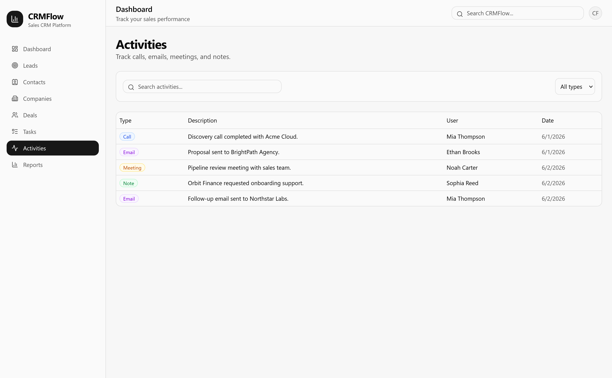
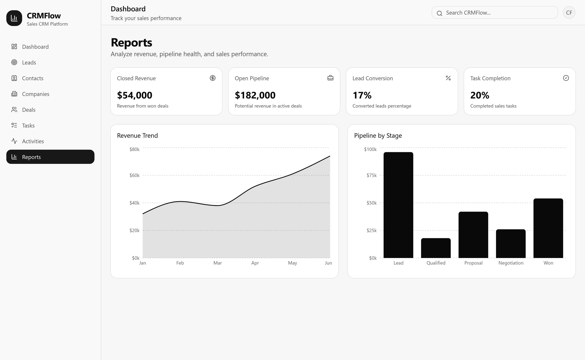

# CRMFlow

A modern sales CRM platform built with **Next.js**, **TypeScript**, **Tailwind CSS**, and **shadcn/ui**.

CRMFlow is a frontend CRM application that simulates how sales teams, SaaS companies, agencies, account managers, and business development teams manage leads, contacts, companies, deals, tasks, activities, and revenue insights from one centralized platform.

Built by **Omar Pervez** — Frontend Engineer specializing in SaaS platforms, CRM systems, ERP applications, dashboards, internal tools, analytics products, and workflow-driven business software.

---

## Demo Video

Watch a short walkthrough of CRMFlow running locally:

[https://github.com/omarpervezz/CRMFlow/raw/main/public/demo/crmflow-demo.mp4](https://github.com/omarpervezz/CRMFlow/blob/main/public/demo/crmflow-demo.mp4)

> Note: CRMFlow is currently a frontend-focused CRM prototype running locally with mock data. It is not deployed publicly at this time.

---

## Overview

As companies grow, spreadsheets and disconnected tools become difficult to manage.

Sales teams need a centralized system to track prospects, manage customer relationships, monitor revenue opportunities, follow up on tasks, record sales activities, and understand pipeline performance.

**CRMFlow** demonstrates how a modern CRM product can be designed and implemented using a scalable, component-driven frontend architecture.

Rather than being a simple CRUD demo, this project focuses on real business workflows commonly found in sales organizations, SaaS companies, agencies, and internal business platforms.

---

## Project Highlights

- Modern sales CRM interface inspired by real SaaS workflows
- Dashboard with KPIs, revenue analytics, pipeline visibility, and sales insights
- Lead, contact, company, deal, task, and activity management
- Deal pipeline with both table and Kanban-style views
- Global search across core CRM records
- Detail drawer patterns for fast record previews
- Reporting section for revenue, pipeline, lead, and task insights
- Feature-based architecture for better scalability and maintainability
- Reusable UI components built with shadcn/ui and Tailwind CSS
- Type-safe data models using TypeScript
- Responsive layout for modern web application experiences

---

## Screenshots

### Dashboard



### Leads



### Deals Pipeline



### Companies



### Contacts



### Tasks



### Activities



### Reports



---

## Core Features

### Dashboard

The dashboard provides a high-level view of CRM performance and sales activity.

- KPI overview
- Pipeline visibility
- Revenue analytics
- Recent activities
- Upcoming tasks
- Sales performance monitoring

### Lead Management

Manage prospects through a structured lead workflow.

- Lead tracking
- Lead qualification workflow
- Status management
- Search and filtering
- Lead detail drawers

### Contact Management

Organize people connected to companies, deals, and sales activity.

- Contact directory
- Company relationships
- Contact details
- Search and filtering
- Relationship visibility

### Company Management

Track companies, industries, revenue potential, and pipeline relationships.

- Company profiles
- Industry classification
- Revenue visibility
- Pipeline association
- Company detail drawers

### Deal Management

Monitor sales opportunities across the revenue pipeline.

- Opportunity tracking
- Revenue forecasting
- Sales pipeline monitoring
- Deal stage management
- Table view
- Kanban pipeline board
- Deal detail drawers

### Task Management

Manage sales follow-ups and internal responsibilities.

- Sales task tracking
- Priority management
- Due date visibility
- Assignee management
- Task detail drawers

### Activity Tracking

Record interactions across the sales process.

- Calls
- Emails
- Meetings
- Notes
- Activity history
- Activity detail drawers

### Reporting

Analyze sales performance and pipeline health.

- Revenue reporting
- Pipeline analytics
- Lead conversion metrics
- Task completion metrics
- Sales performance insights

### Global Search

Search across key CRM entities from one place.

- Leads
- Contacts
- Companies
- Deals

---

## Tech Stack

### Frontend

- Next.js 15
- React 19
- TypeScript
- Tailwind CSS v4
- shadcn/ui
- Radix UI
- Lucide Icons
- Recharts

### Architecture

- App Router
- Feature-based folder structure
- Shared component library
- Reusable business components
- Responsive layouts
- Type-safe models
- Mock CRM datasets

---

## Project Structure

```txt
app/

components/
  layout/
  shared/
  ui/

features/
  dashboard/
  leads/
  contacts/
  companies/
  deals/
  tasks/
  activities/
  reports/

lib/
  data/

types/
```

---

## Key Features Implemented

- Sales dashboard
- CRM pipeline management
- Global search
- Deal pipeline board
- Detail drawers
- Revenue reporting
- KPI analytics
- Search and filtering
- Activity tracking
- Reusable UI components
- Feature-based architecture
- Mock CRM data models
- Responsive business application layout

---

## Getting Started

### 1. Clone the repository

```bash
git clone https://github.com/your-username/crmflow.git
```

### 2. Navigate into the project

```bash
cd crmflow
```

### 3. Install dependencies

```bash
pnpm install
```

### 4. Start the development server

```bash
pnpm dev
```

### 5. Open the app

```txt
http://localhost:3000
```

---

## Current Status

CRMFlow is currently a frontend-focused CRM prototype using mock data.

It does not currently include:

- Authentication
- Backend APIs
- Database persistence
- User roles
- Real-time collaboration

These features are planned as future improvements.

---

## Why I Built This

I specialize in building SaaS platforms, CRM systems, ERP software, dashboards, analytics applications, internal tools, customer portals, and workflow-driven business software.

CRMFlow was created to demonstrate how a modern sales CRM can be structured, designed, and implemented as a realistic business application.

The goal of this project is to show practical frontend engineering skills in areas that matter for real software products:

- Translating business workflows into usable interfaces
- Designing scalable feature-based architecture
- Building reusable UI systems
- Working with structured CRM data
- Creating dashboards, reports, and operational views
- Developing SaaS-style application experiences

This project reflects the type of frontend work required by SaaS companies, startups, agencies, software consultancies, and growing businesses building internal or customer-facing platforms.

---

## Future Improvements

- Dark mode
- Command palette
- Drag-and-drop pipeline board
- Advanced sales forecasting
- Advanced analytics
- Authentication
- Role-based permissions
- Team management
- Activity timelines
- Real backend APIs
- Database persistence
- Audit logs
- Notifications
- Import/export functionality
- CRM automation workflows

---

## Author

### Omar Pervez

Frontend Engineer specializing in:

- SaaS platforms
- CRM systems
- ERP systems
- Internal tools
- Dashboards
- Analytics applications
- Customer portals
- Business web applications

I help SaaS companies, startups, agencies, and software consultancies build CRM systems, dashboards, internal tools, ERP platforms, analytics applications, customer portals, and workflow-driven business software.

---

## Contact

Email: [omar@omarpervez.com](mailto:omar@omarpervez.com)

If you are building business software and need a reliable frontend partner, feel free to reach out.
